# TP1

## Exercice 1 

```text
Lauret Alexandre
Commande d'installation : mamba env create -f csc8614/TP1/requirements.txt -n csc8614
Version Python/Librairie : Python 3.12.3
torch 2.9.1
transformers 4.57.3
plotly 6.5.1
sklearn 1.8.0
```
## Exercice 2

### Question 2.a

['Art', 'ificial', 'Ġintelligence', 'Ġis', 'Ġmet', 'amorph', 'osing', 'Ġthe', 'Ġworld', '!']

Le "Ġ" permet de remplacer l'espace dans le cas d'un tokenizer BPE. Cela permet ensuite de reformer les phrases complètes en ayant le fin et les débuts des mots.

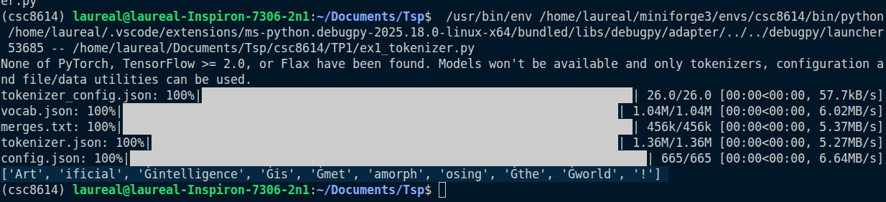


### Question 2.b

| Token ID | Token décodé    | Remarque                                                    |
| -------- | --------------- | ----------------------------------------------------------- |
| 8001     | 'Art'           |                                                             |
| 9542     | 'ificial'       | Mot séparé en deux                                          |
| 4430     | ' intelligence' | Mot complet avec un espace collé au début                   |
| 318      | ' is'           |                                                             |
| 1138     | ' met'          |                                                             |
| 37670    | 'amorph'        |                                                             |
| 2752     | 'osing'         | Décomposition du mot en trois avec la conjugaison séparée   |
| 262      | ' the'          |                                                             |
| 995      | ' world'        |                                                             |
| 0        | '!'             | Le point d'exclamation est une ponctuation, id spécial      |

Les tokens sont des suites de caractères par exemple un mot qui sera traité dans son ensemble.
Le token_id est simplement la position du token dans le vocabulaire du modèle 

### Question 2.c

On peut premièrement observer la gestion des espaces, ces espaces ont intégrés à l'intérieur des tokens pour retrouver les débuts/fins de mots.
Les mots rares sont rangés dans des sous catégories de mot, pour artificial il reconnait le mot 'art' puis ificial, cela permet de réduire la taille du vocabulaire. Par ailleurs le ificial apparaît souvent et peut largement être réutilisé (e.g : specificially).
Pour 'intelligence' ou 'world' les mots apparaissent assez souvent pour caractériser entièrement un token.
Ce qui est intéressant est le fait que la conjugaison est aussi séparé du mot racine comme pour metamorphosing où le osing (gérondif) est reconnaissable facilement.

### Question 2.d

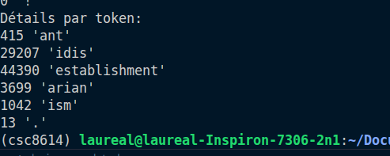

Pour ce mot, GPT2 génère 5 token (sans compter le .). 
Ce mot est découpé comme ceci car : ant, arian et ism sont souvent utilisés dans la langue anglais et portent un sens, le ant peut par exemple signifier l'opposition.
estabilishment est un mot comment assez souvent rencontré pour représenter un token en soi.
idis serait simplement un complément qui permet de relier le reste.

## Exercice 3

### Question 3.a

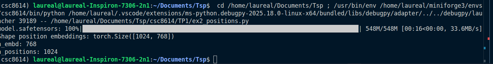

La shape est de 1024 par 768. 1024 est le nombre de token maximal possible et 768 est le nombre de chiffres, représentant un savoir, que nous pouvons stocker sur un seul token.
Pour ce modèle de langage causal, n_positions signifie que nous avons une limite de token que nous pouvons envoyer au modèle. Si le nombre de token dépasse, le modèle perdra le fil du début de la conversation.

### Question 3.b

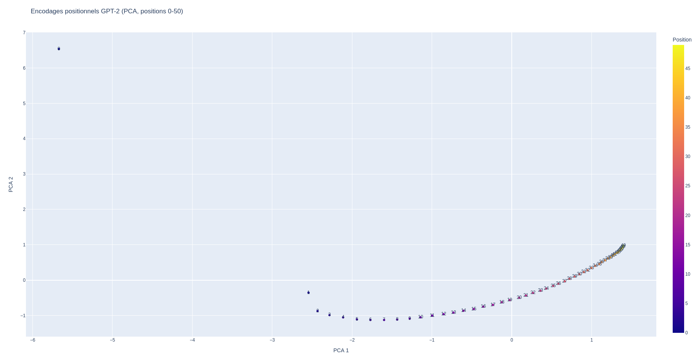

On peut observer une ligne continue de points en courbe, il n'y a pas de saut de position. Par ailleurs les données ne sont pas regroupés en amas et la trajectoire de la courbe est claire. 

La PCA permet de réduire le nombre de dimension afin que les modèles puissent traiter les données plus rapidement tout en réduisant les corrélations entre les variables. La visualisation ici est notamment possible en 2D grâce à cette réduction de dimensionnalité.

### Question 3.c

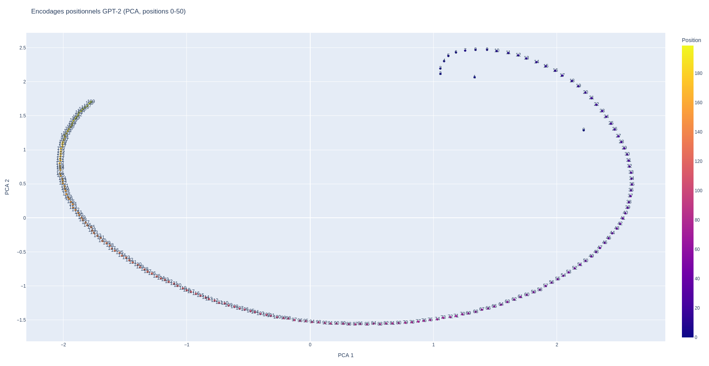

On voit que le 0-200 forme plutôt une boucle alors que le 0-50 laissait présager d'une courbe assez linéaire. La structure reste tout de même complètement lisible et fait penser au début de la représentation du nombre d'or, ce qui est très beau. L'alignement reste continue et ne forme toujours pas d'amas.

Cela implique que la représentation n'est pas linéaire ce qui rend plus compliqué le calcul pour les prochains mots. 

## Exercice 4

### Question 4.a

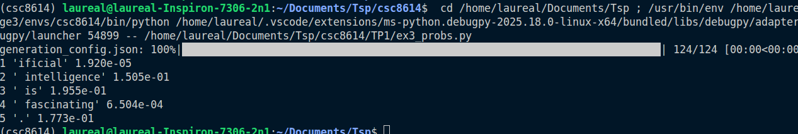

On peut observer qu'"Art" n'apparaît pas. Cette probabilité n'est pas calculé car celles-ci sont des probabilités conditionnelles, elles se basent sur les probababilités précédentes pour se calculer. On ne peut pas calculer la probabilité de la première. (P(t-1|t)).

Cependant, nous pouvons observer les différentes probabilités calculés et à quel point le modèle s'y "attendait" en d'autres termes à quel point est-ce qu'il aurait généré la même phrase.
On peut observer une très fabile probabilité de trouver ificial après Art ce qui signifie que sûrement d'autres tokens sont généralement lus après Art ce qui est logique car c'est un mot indépendant aussi. Par contre la probabilité de trouver intelligence artificial et bien plus élevée dû à l'augmentation de l'utilisation de ce terme par exemple.

### Question 4.b

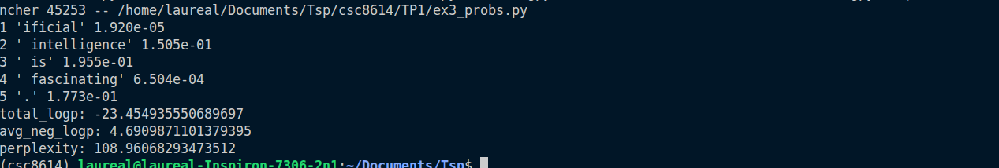

La perplexité provient de la somme des logarithmes des probabilités puis du calcul de la moyenne par mot. On obtient comme cela une mesure qui peut etre comparé à n'importe quelle chaîne de caractère. L'exponentielle permet de contrebalancer les logs et de rendre à la métrique un sens en terme d'unité.

### Question 4.c

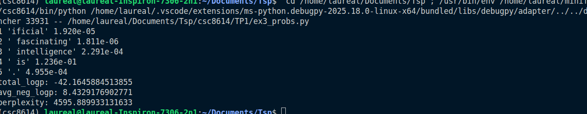

4595.889933131633 - 108.96068293473512 = 4486.9292502 

On observe que la perplexité a explosé avec la deuxième phrase. La raison est simple, la logique de la phrase est plus difficile à deviner car les mots sont mélangés. La suite des mots ne fait pas sens, le modèle est "perplexe".
Fascinating après artificial a par exemple une probabilité très faible d'être trouvé, pareil pour intelligence après fascinating, tout cela fait chuter la probabilité de trouver ces mots.


### Question 4.c

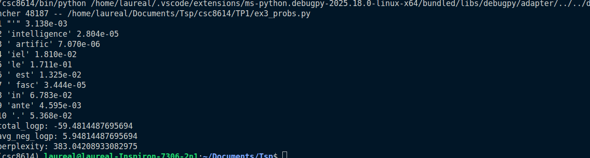

383.04208933082975
On observe que la perplexité est plus haute que la perplexité de la langue anglaise pour la même phrase. Cela peut être expliqué par le fait que GPT2 a été principalement entraîné dans la langue anglais ce qui lui permet de générer principalement de la langue anglaise. Cependant la perplexité reste bien inférieur à la perplexité de la deuxième phrase anglaise où les mots étaient mélangés ce qui indique que la phrase a plus de sens pour lui. Les tokens sont aussi découpés de manière distinctes selon les langues.

### Question 4.e

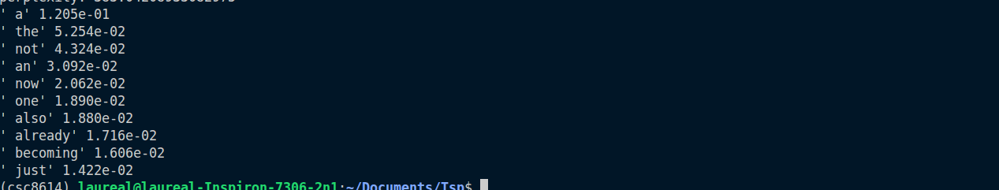

' a' 1.205e-01
' the' 5.254e-02
' not' 4.324e-02
' an' 3.092e-02
' now' 2.062e-02
' one' 1.890e-02
' also' 1.880e-02
' already' 1.716e-02
' becoming' 1.606e-02
' just' 1.422e-02

Les propositions paraissent censées chaque mot peut rendre la phrase logique ce qui est bien attendu de la part des propositions de GPT. On remarque l'absence de ponctuation car il détecte que la phrase a très peu de chance de se finir ici, la phrase est en suspens. Chaque token propose aussi un espace à leur début, le modèle comprend que "is" est la fin du mot.

## Exercice 5

### Question 5.a

Le seed utilisé dans mon code est le seed 42.
On le fixe pour avoir des résultats reproductibles. A chaque lancement le modèle trouvera les mêmes répartitions de probabilité.

### Question 5.b

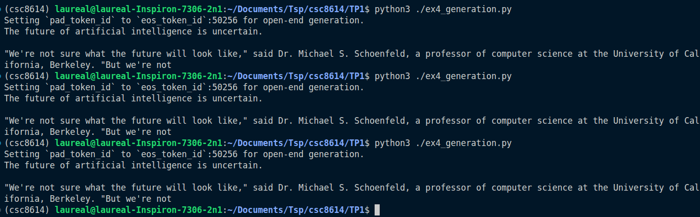

```text 

The future of artificial intelligence is uncertain.

"We're not sure what the future will look like," said Dr. Michael S. Schoenfeld, a professor of computer science at the University of California, Berkeley. "But we're not

```
Les 3 lancements génèrent le même texte chaque fois. Cela est sûrement dû au seed que nous avons pu bloqué dans la question précédente. Ainsi qu'à l'algorithme choisi.

### Question 5.c

SEED 1
Setting `pad_token_id` to `eos_token_id`:50256 for open-end generation.
The future of artificial intelligence is up in the air, and the future of artificial intelligence is now about to change. For now, we're just waiting for the technology to be perfected so that we can take it to the next level.

The

SEED 2
Setting `pad_token_id` to `eos_token_id`:50256 for open-end generation.
The future of artificial intelligence is not clear, but that could change. The early progress of AI has been largely due to the ability to do some things fairly quickly, like calculate things, but the future is not clear. The early progress of AI has

Avec le changement de la Seed on voit des différences dans l'output. Cela car le modèle gère avec un petit peu d'aléatoire les tokens choisis selon leur statistique. La température maitrise la modification des probabilités de manière aléatoire, plus la température descend plus les résultats seront déterministes. Le top k permet de choisir le prochain mot aléatoirement parmis les 50 meilleurs mots trouvés. Le top p va forcer à choisir parmis les 95 meilleurs pourcent cela permet de contrôler les tokens choisis par le modèle au cas où il y ait une grande disparité entre par exemple les 3 premiers token générés qui rempliront les 95% pourcent de probabilité de prochain mot et les 47 autres qui ne représenteraient 5%.

### Question 5.d

SEED 1
Setting `pad_token_id` to `eos_token_id`:50256 for open-end generation.
The future of artificial intelligence is up in the air, and it may not be as interesting or useful to us humans. But we're going down a path where our ability for thinking about things could become less important than ever before."
 (Photo:

Sur cette seed 1 avec une pénalité sur la répétition la deuxième phrase est différente, on ne répète pas les premiers mots de la phrase d'avant comme sur le seed 1 sans pénalité. Comme effect seondaire on constate que ça change les phrases qui suivent et le sens de la phrase.

### Question 5.e

0.1 : The future of artificial intelligence is uncertain. But the future of artificial intelligence is not.

The future of artificial intelligence is not.

The future of artificial intelligence is not.

The future of artificial intelligence is not.

The

2.0 : The future of artificial intelligence is up in the air again in 2014 as Google unveils its new platform called MachineStory-AI called Watson from the Stanford Institute for Artificial Intelligence (SetBorg). For IBM and for everyone trying to get their heads in

A température de 2.0, les tokens générés ne sont pas très logique, la phrase ne porte pas de sens et les informations sont fausses (on passe de microsoft à ibm par exemple.) Alors qu'à 0.1 les tokens ne font que se répéter, la diversité est au plus faible. Mais nous pouvons améliorer ça en ajouter la penalité sur la répétition comme précédemment : 

The future of artificial intelligence is uncertain. But the question remains: Will we ever be able to predict what will happen in our lives?
, a new book by John Dower and David Mazzucchelli explores how AI can help us understand


### Question 5.f

The future of artificial intelligence is in the hands of the next generation of scientists and engineers.

The future of artificial intelligence is in the hands of the next generation of scientists and engineers.

The future of artificial intelligence is in the hands of

Le beam se rapproche d'un modele sampling avec un température très faible il est très sûr, il y a très peu de diversité, c'est pour cela que les phrases se répètent.

### Question 5.g

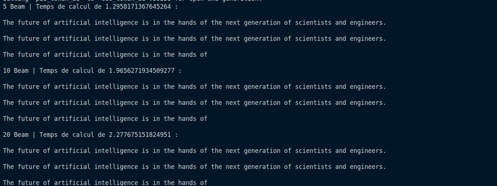

Nous trouvons les mêmes phrases avec un plus grand temps de calcul au fur et à mesure de l'augmentation des beams. Cela est dû au fait que le modèle cherche les tokens les plus probables à chaque fois et trouve les mêmes. Il y aurait sûrement des différences sur un plus grand ensemble de tokens. La complexité augmente étant donné que nous calculons 5 probabilités d'ensemble de tokens complet puis 10 puis 20 afin de s'assurer d'obtenir la chaîne la plus probable.