# TP 4

## Exercice 1

### Question 1.h

Succès de l'installation :

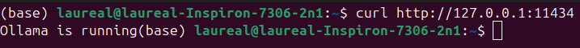

Téléchargement du modèle : 

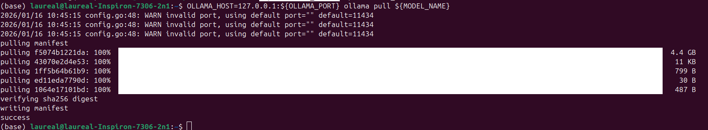

Variable d'environnement : 

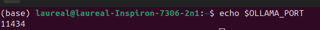

## Exercice 2

### Question 2.b

Chargement des fichiers pdfs

### Question 2.f

Téléchargement des mails : 

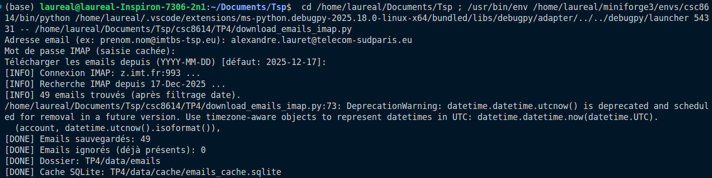

Nombre de fichiers téléchargés : 

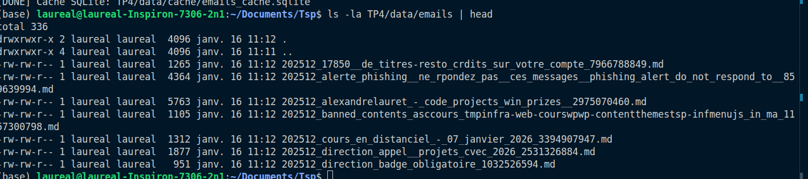

Début d'un mail : 

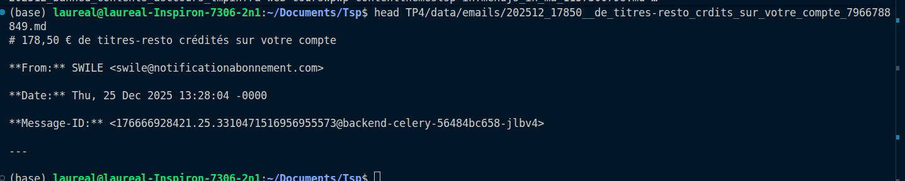

## Exercice 3

### Question 3.e

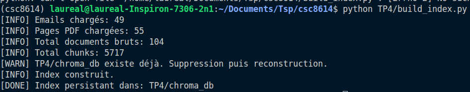

Le dossier chroma_db n'est pas vide :

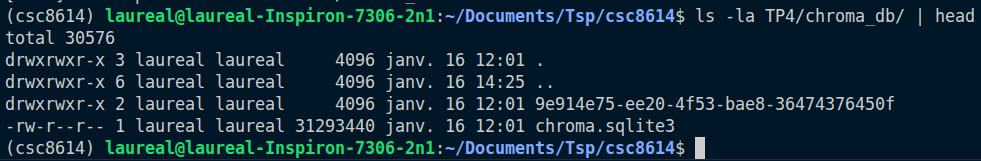

## Exercice 4

### Question 4.e

La valeur choisie de topk est de 3.

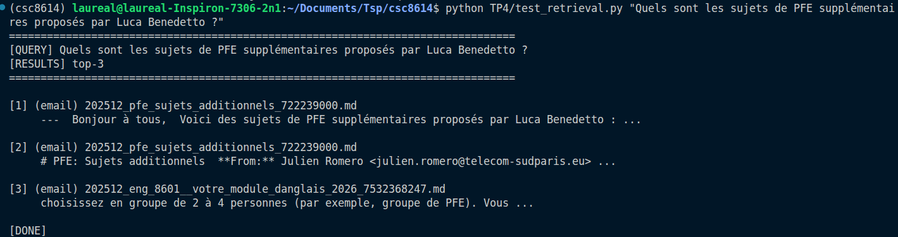

Dès le premier mail, on a un mail en rapport avec les sujets supplémentaires de PFE par Luca Benedetto.

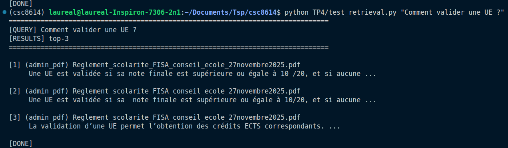

Pareil pour cette deuxième question, nous avons rapidement les réponses parmi les premières lignes de retour.

## Exercice 5

### Question 5.e

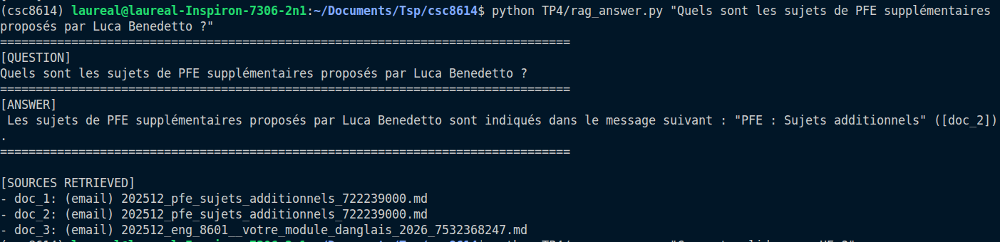

Le script se déroule parfaitement, on observe une réponse en français avec la citation du mail mentionné dans la réponse. Cependant, nous n'avons pas la réponse à la question en clair dans la réponse, nous devons aller dans le mail.

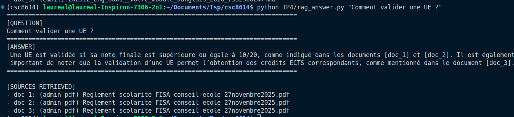

Cette réponse aussi est en français et complète avec les sources correctement cités même si ce sont les trois mêmes.

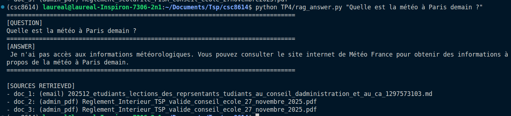

Dans ce cas où l'information n'est pas donné, le modèle répond bien que l'information n'est pas disponible.

### Question 6.e

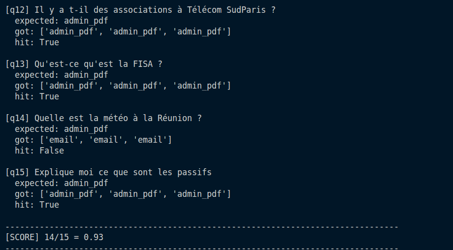

Le modèle trouve des réponses à toutes les questions hormis la question sur des informations qu'il ne possède pas : la météo à la Réunion, ce qui semble logique.

### Question 6.f

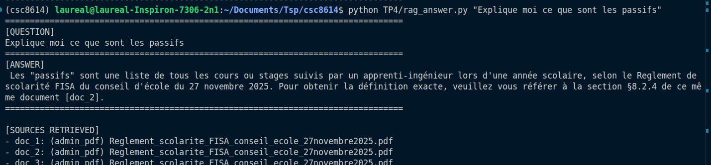

La réponse est tout a fait halluciné. Il n'y a pas de rapport avec les passifs : 0

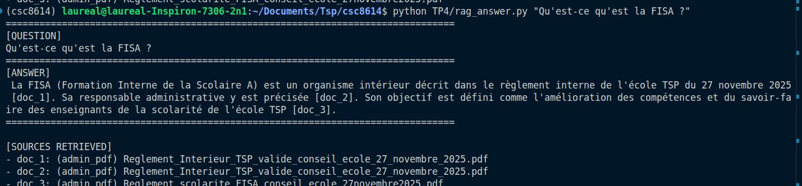

La FISA n'est pas une formation interne de la scolaire c'est la formation ingénieur sous statut étudiant : 0

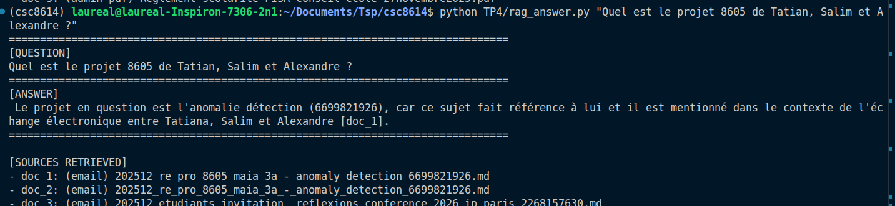

Le sujet est le bon : l'anomaly detection, il ne l'a pas écrit correctement car le modèle écrit en francais. Cependant il trouve bien l'information parmi les mails. De plus, le mail référencé est correct : 1

### Question 6.g

Dans la question sur les passifs, on peut imaginer que le contexte du pdf était trop long ou que le contexte sur les passifs n'était pas assez précis. Le fait d'augmenter le chunking et préciser le prompt pourrait mener à une amélioration de la réponse.

Concernant la FISA, le même problème de chunking doit survenir, la précision de la réponse pourrait être améliorée. Le TopK n'améliorerait pas les réponses car celles-ci se trouvent dans un seul document.

### Question 6.h

Un extrait du fichier de question :

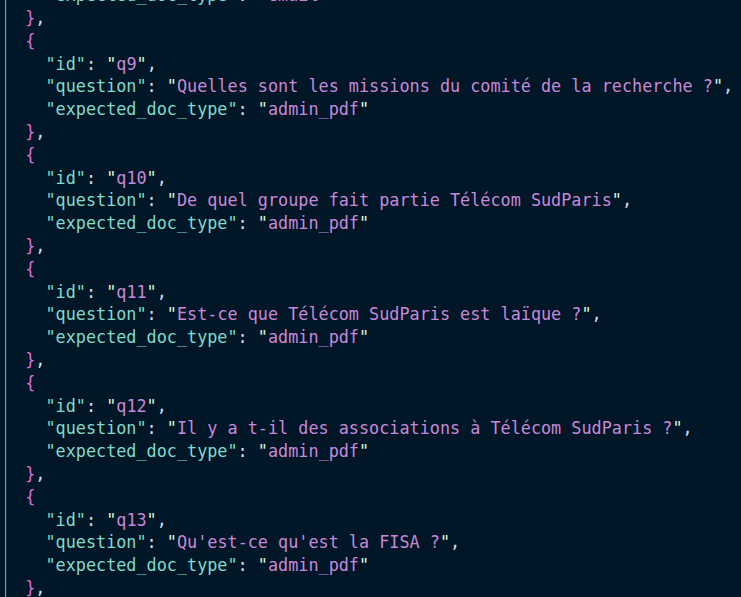

### Question 6.i

Ce qui a bien marché : 
    Le recherche des informations a vraiment bien fonctionné, lorsque les mots clefs étaient mentionnés, ils étaient retrouvés directement, nous le voyons avec le score d'eval_recall. Lorque la réponse est contenue dans un paragraphe court, le llm répond correctement.

La principale limite rencontrée :
    Les données doivent être contenus dans les fichiers partagés et le llm perd rapidement le fil des explications. Même s'il trouve l'information dans les fichiers, les explications ne sont pas correctes.

Une amélioration prioritaire si vous deviez le déployer : 
    Des améliorations simples à mettre en place qui permettrait à ce RAG d'être utilisable est l'augmentation de la taille des chunks afin d'avoir une compréhension plus poussée des documents. Par ailleurs il serait bon d'augmenter le nombre de document sur lequel peut se baser le RAG par exemple en utilisant l'ensemble des fichiers de google.

