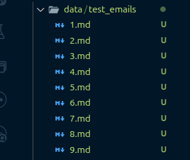
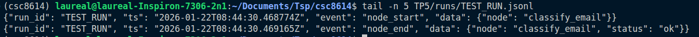
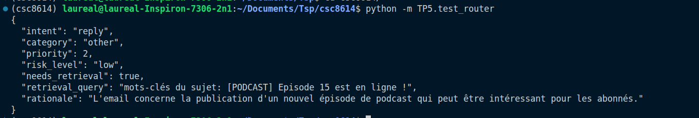
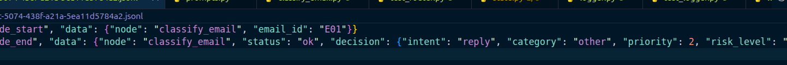
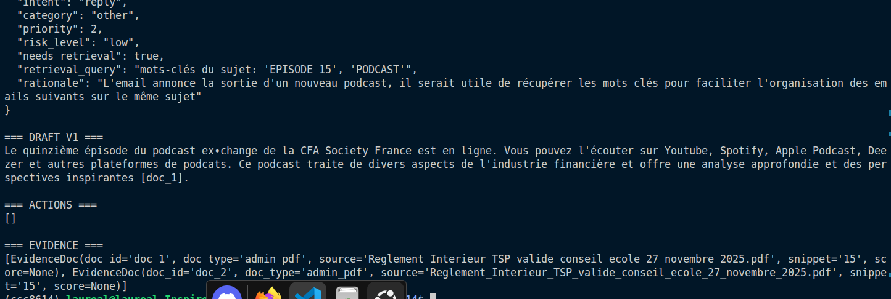
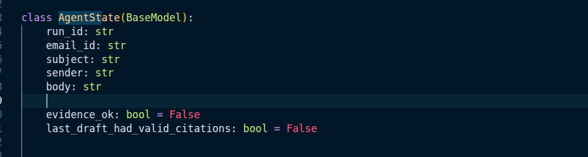
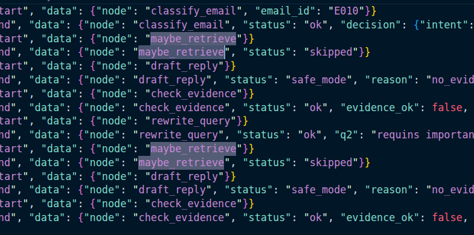

# TP5

## Exercice 1

### Question C

## Exercice 2

### Question 2.d

J'ai noté les emails du E01 au E09

En récupérant des mails depuis trois adresses différentes, j'ai pu obtenir des spams, des newsletter, des demandes de devoirs, des retours de projet ainsi que des mails contenant des données personnelles que je supprimerai à la fin du TP. Cela permet de voir l'ensemble des schéma de mails que je peux recevoir.

### Question 2.f

Les 9 mails ont été correctement chargés. 

## Exercice 3

### Question 3.b

### Question 3.e

## Exercice 4

### Question 4.d

décision : reply

## Exercice 5

### Question 5.f

## Exercice 6

### Question 6.d

On voit bien le maybe_retrieve qui est appelé.

## Exercice 7

### Question 7.c

cas evidence non vide : 

cas evidence vide :

## Exercice 8

### Question 8.a

## Question 8.f

